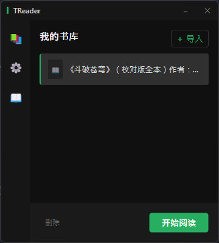
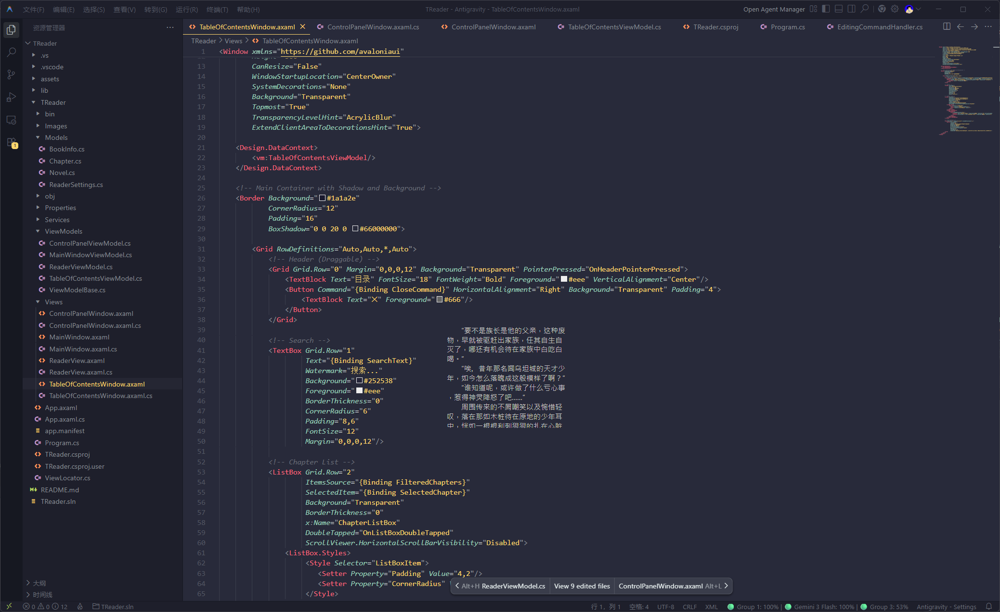

# 📖 TReader - 工位摸鱼看小说神器

> Transparent Reader 完美隐藏在背景里的小说阅读器，老板来了鼠标移开自动隐藏

一个**透明背景、自动隐藏**的小说阅读器，上班摸鱼用的。

💡 **灵感来源**：幽灵阅读器（可惜收费），就vibecoding搓了一个。

---

## ✨ 核心功能

| 功能               | 描述                                                         |
| ------------------ | ------------------------------------------------------------ |
| 🪟 **透明背景**     | 阅读窗口背景全透明，文字悬浮在任何应用上方，老板路过只会看到你的 IDE |
| 👻 **自动隐藏**     | 鼠标移开自动消失，Ctrl + 双击原位置即可召回，比忍者还能隐身  |
| 📐 **自由缩放**     | 窗口大小随意拖拽，适配各种屏幕                               |
| 🎨 **个性化设置**   | 字体、字号、行距、颜色全部可调，打造属于你的阅读体验         |
| 💾 **进度自动保存** | 下次打开直接跳到上次阅读位置，再也不用手动翻页找半天         |
| 📑 **智能章节目录** | 自动识别章节结构，一键跳转                                   |

---

## 🖼️ 使用效果

### 托盘菜单

右击系统托盘图标：

### 书架界面

没啥特别的：

### 自动隐藏演示

鼠标移开 → 瞬间消失 → Ctrl+双击 → 再次出现：

### 最终效果

> 文字颜色调暗一点就更隐藏了

---

## 🚀 快速开始

### 安装

1. 前往 [Releases](../../releases) 下载最新版本
2. 解压到任意目录
3. 双击 `TReader_setup.exe` 运行
4. 开看

> ⚠️ **注意**：需要 .NET 8.0 运行时

### 使用技巧

1. **第一次启动**会自动打开控制面板
2. **关闭控制面板**后，程序自动躲进系统托盘
3. **阅读窗口找不到了？** 托盘右键菜单 → "刷新阅读窗口"
4. **召回隐藏的窗口**：按住 Ctrl + 双击窗口原来的位置

---

## 🛠️ 技术栈

| 技术             | 说明                                                           |
| ---------------- | -------------------------------------------------------------- |
| **Avalonia 11**  | 跨平台 UI 框架（虽然隐藏功能用了 Windows API，跨平台需要适配） |
| **.NET 8**       | 运行环境                                                       |
| **AvaloniaEdit** | 文本编辑器组件（用于渲染小说内容）                             |
| **ReactiveUI**   | MVVM 响应式框架                                                |

---

## 📜 开源协议

MIT License - 随便用，但出事自己负责（比如被老板抓到）

---

## ⚠️ 免责声明

本软件仅供**学习交流**使用。使用本软件摸鱼导致的任何后果，作者概不负责。

